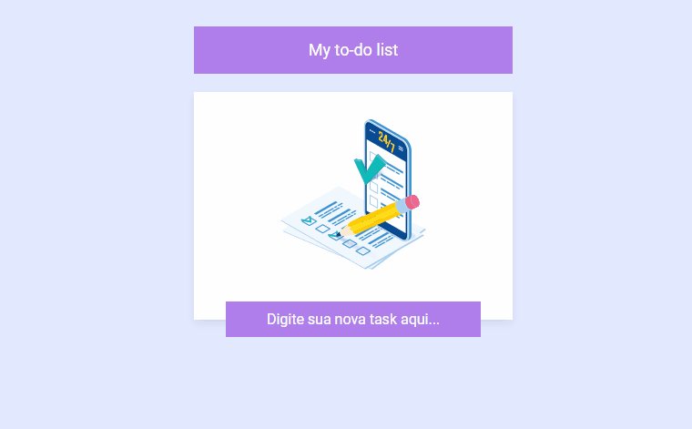

# My to-do list 

Projeto criado com a versão Angular 14.2.3. A aplicação mostra uma lista de tarefas, podendo adicionar itens e deletar, item por item ou todos.

## Linguagens e tecnologias

    
    
        

 

## Preview 

[]

## Development server

Rode no terminal o comando `ng serve` ou `ng s -o`  para conseguir abrir o projeto no navegador e vizualiza-lo. 

